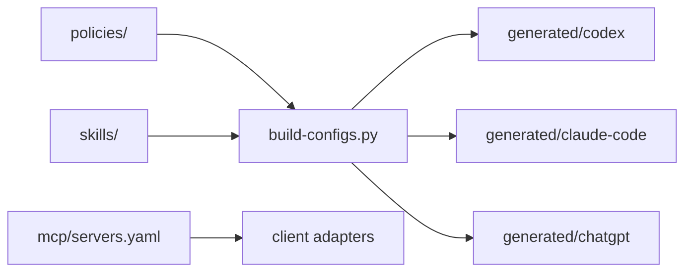

# Architecture

## Концепция

`policies/` является каноническим набором правил. `skills/` содержит переиспользуемые workflows. `mcp/servers.yaml` описывает MCP-серверы независимо от клиента. `scripts/build-configs.py` генерирует клиентские артефакты в `generated/`.

## Поток данных

## Безопасность

Секреты не хранятся в Git. Скрипты показывают план, поддерживают dry-run и делают backup перед изменениями.
